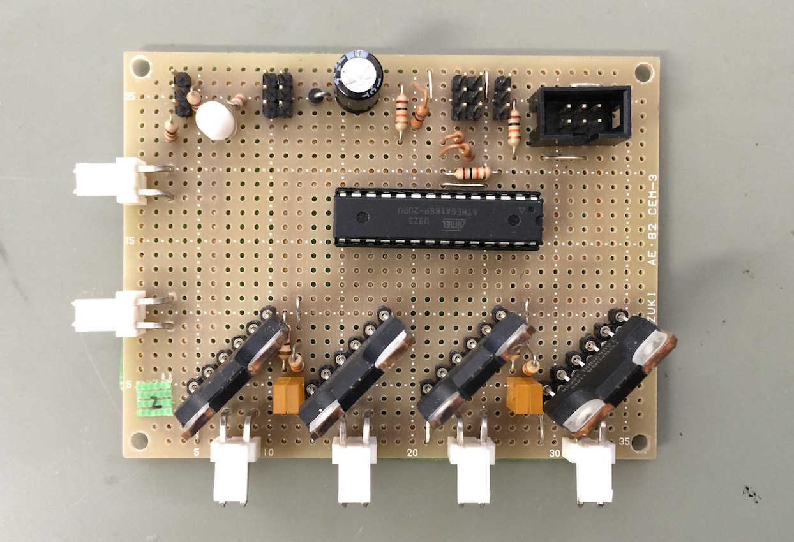

# 4WheelDriver
足回り４WD用

## IO
- PWM入力 x2 (制御信号)
- DCモータ出力 x2 個分
- シリアル通信ポート
- AVR ISP 書き込みポート

## 仕様
２つの出力がそれぞれ二つのモータドライバにつながった回路

４輪駆動でタイヤの動きが前後で常に同じ場合に使用

TPIPのPWM信号を入力に取り、そのデューティ比に応じて出力が変わる

デューティ比 50%でストップするはず

ディジタル入力をHighにすると対応するモータの出力が停止する

## TODO

- Atmel Studio Project/ Linux等用Makefile を作る
- プログラムのリファクタリング
